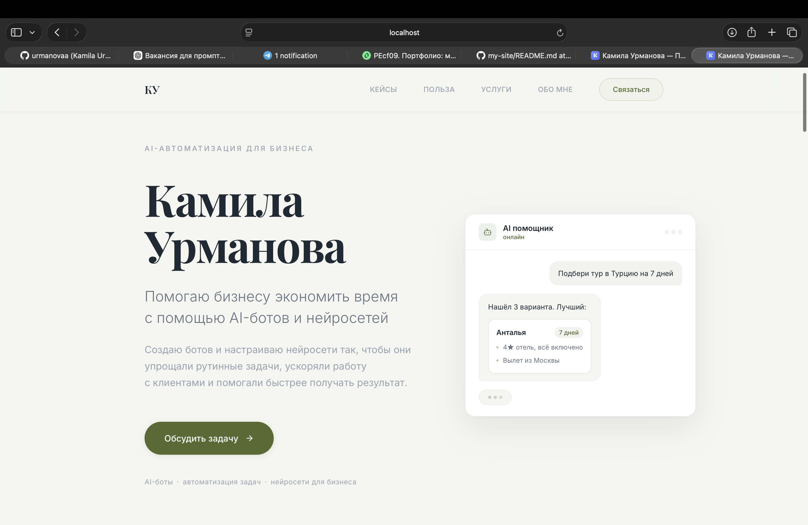
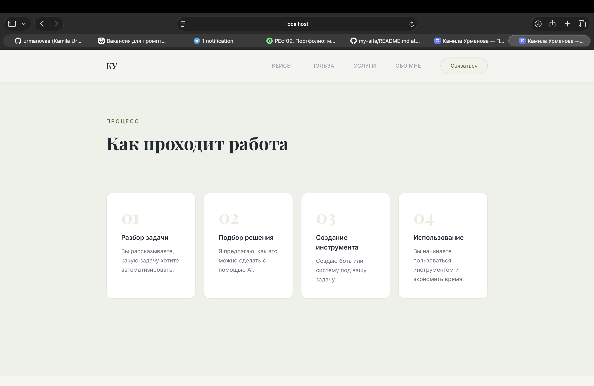
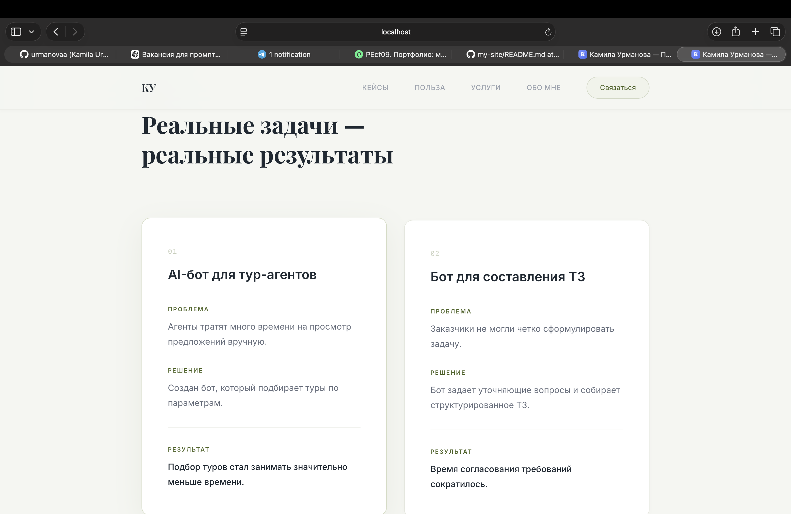
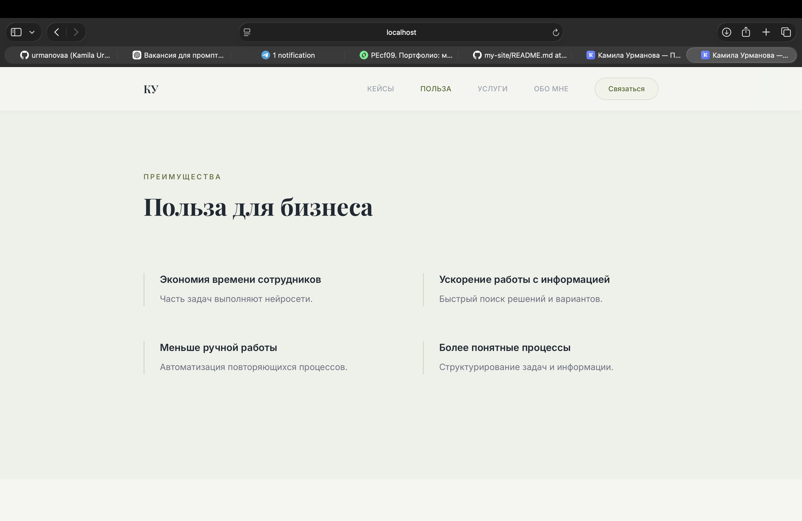
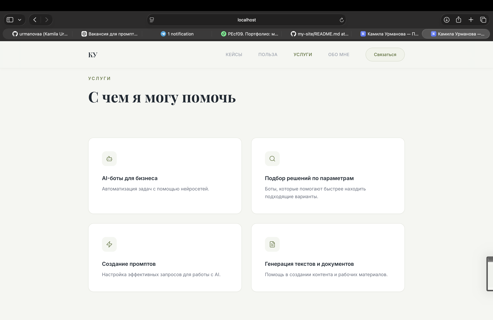
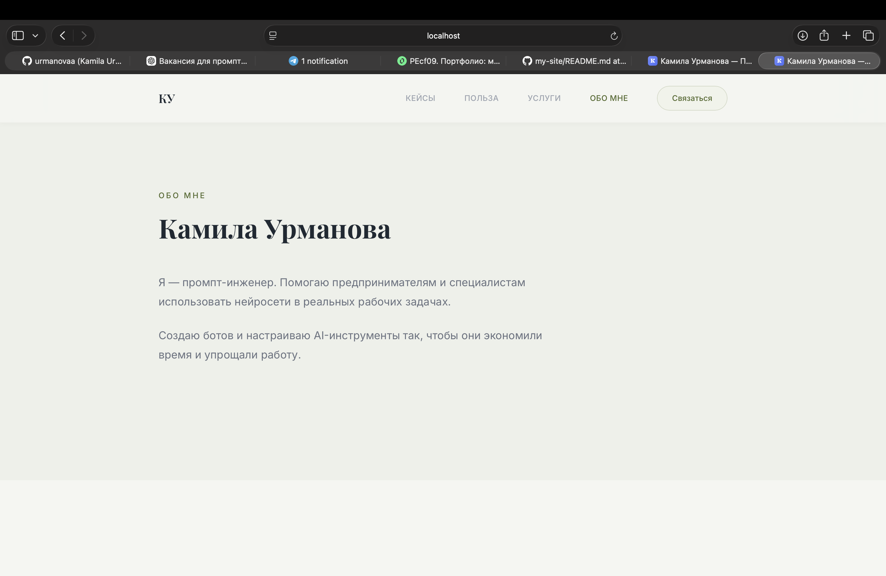
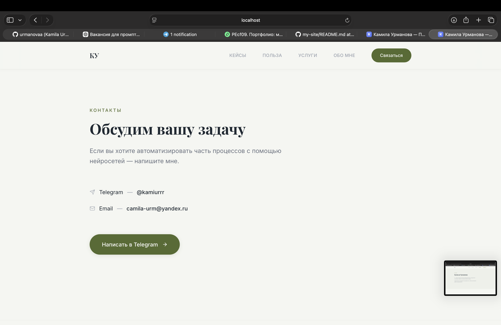

# Kamila Urmanova — AI Automation & Prompt Engineering

Я помогаю бизнесу экономить время с помощью AI-ботов и нейросетей.

Этот сайт — портфолио моих решений по автоматизации: от AI-ассистентов до инструментов, которые ускоряют работу специалистов и уменьшают ручную рутину.

Здесь можно посмотреть:
- примеры AI-решений для бизнеса  
- мой подход к работе и внедрению автоматизации  
- какие задачи можно решить с помощью AI  
- как со мной связаться для сотрудничества  

---

## Скриншоты проекта

### Главная страница

### Как я работаю

### Кейсы

### Польза для бизнеса

### Услуги

### Обо мне

### Связаться

---

## Что я делаю

Я создаю AI-инструменты, которые помогают бизнесу автоматизировать рутинные задачи и ускорять работу специалистов.

Например:

- AI-боты для обработки запросов клиентов  
- автоматизация подготовки документов и технических заданий  
- AI-ассистенты для специалистов  
- инструменты на базе LLM для поиска и структурирования информации  

Главная цель — **сократить ручную работу и ускорить процессы в компании.**

---

## Примеры задач, которые можно автоматизировать

- подбор решений или услуг по заданным параметрам  
- подготовка технических заданий  
- ответы на типовые запросы клиентов  
- структурирование информации и документов  
- ускорение внутренних процессов компании  

---

## Технологии

Проект создан с использованием современных веб-инструментов:

- React  
- Vite  
- JavaScript  
- CSS  

---

## Запуск проекта

Если вы хотите запустить сайт локально:
# Kamila Urmanova — AI Automation & Prompt Engineering

Я помогаю бизнесу экономить время с помощью AI-ботов и нейросетей.

Этот сайт — портфолио моих решений по автоматизации: от AI-ассистентов до инструментов, которые ускоряют работу специалистов и уменьшают ручную рутину.

Здесь можно посмотреть:
- примеры AI-решений для бизнеса  
- мой подход к работе и внедрению автоматизации  
- какие задачи можно решить с помощью AI  
- как со мной связаться для сотрудничества  

---

## Скриншоты проекта

### Главная страница

### Как я работаю

### Кейсы

### Польза для бизнеса

### Услуги

### Обо мне

### Связаться

---

## Что я делаю

Я создаю AI-инструменты, которые помогают бизнесу автоматизировать рутинные задачи и ускорять работу специалистов.

Например:

- AI-боты для обработки запросов клиентов  
- автоматизация подготовки документов и технических заданий  
- AI-ассистенты для специалистов  
- инструменты на базе LLM для поиска и структурирования информации  

Главная цель — **сократить ручную работу и ускорить процессы в компании.**

---

## Примеры задач, которые можно автоматизировать

- подбор решений или услуг по заданным параметрам  
- подготовка технических заданий  
- ответы на типовые запросы клиентов  
- структурирование информации и документов  
- ускорение внутренних процессов компании  

---

## Технологии

Проект создан с использованием современных веб-инструментов:

- React  
- Vite  
- JavaScript  
- CSS  

---

## Запуск проекта

Если вы хотите запустить сайт локально:
npm install
npm run dev

После запуска сайт будет доступен по адресу:
http://localhost:5173

---

## Автор

**Kamila Urmanova**  
AI Automation & Prompt Engineering  

Email: camila-urm@yandex.ru  
Telegram: @kamiurrr
