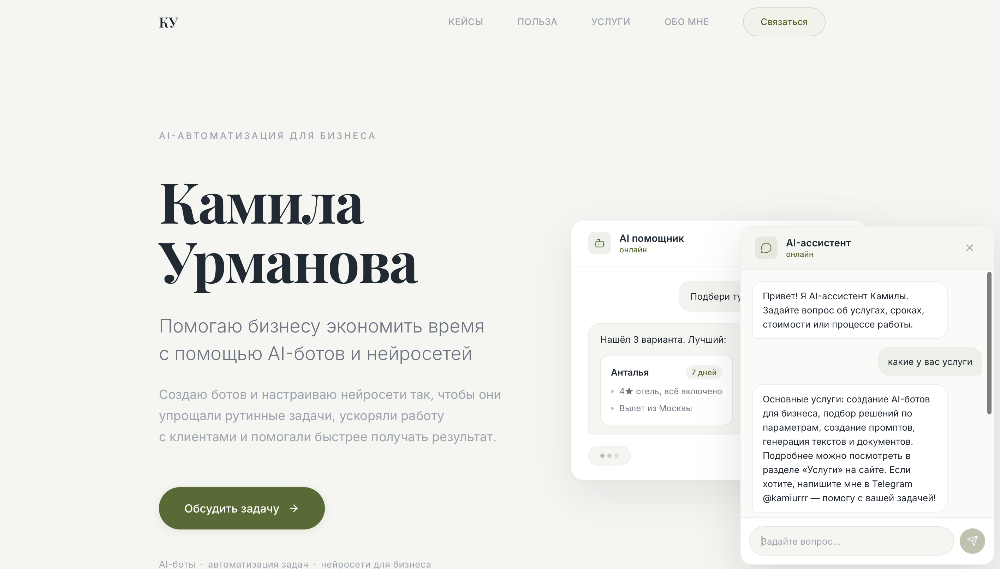
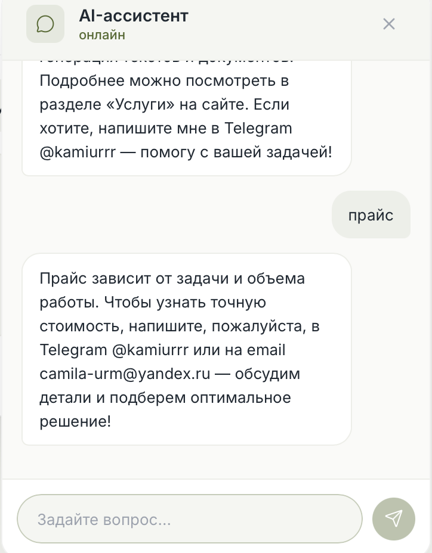

# Kamila Urmanova — AI Automation & Prompt Engineering

Я помогаю бизнесу экономить время с помощью AI-ботов и нейросетей.

Этот сайт — портфолио моих решений по автоматизации: от AI-ассистентов до инструментов, которые ускоряют работу специалистов и уменьшают ручную рутину.

Здесь можно посмотреть:
- примеры AI-решений для бизнеса  
- мой подход к работе и внедрению автоматизации  
- какие задачи можно решить с помощью AI  
- как со мной связаться для сотрудничества  

---

## Скриншоты проекта

### Главная страница


### Как я работаю


### Кейсы


### Польза для бизнеса


### Услуги


### Обо мне


### Связаться


---

## FAQ-ассистент (чат-бот)

На сайте встроен AI-ассистент, который отвечает на вопросы посетителей об услугах, стоимости, сроках и процессе работы.

Как работает:
- **RAG-система:** вопрос пользователя → эмбеддинг (OpenAI) → поиск похожих FAQ в FAISS → контекст передаётся в GPT-4.1-mini
- **История диалога:** бот запоминает контекст разговора и понимает уточняющие вопросы
- **16 типовых FAQ** в файле `data/faqs.json`

### Приветствие чата


### Уточняющий вопрос


---

## Что я делаю

Я создаю AI-инструменты, которые помогают бизнесу автоматизировать рутинные задачи и ускорять работу специалистов.

Например:

- AI-боты для обработки запросов клиентов  
- автоматизация подготовки документов и технических заданий  
- AI-ассистенты для специалистов  
- инструменты на базе LLM для поиска и структурирования информации  

Главная цель — **сократить ручную работу и ускорить процессы в компании.**

---

## Примеры задач, которые можно автоматизировать

- подбор решений или услуг по заданным параметрам  
- подготовка технических заданий  
- ответы на типовые запросы клиентов  
- структурирование информации и документов  
- ускорение внутренних процессов компании  

---

## Технологии

**Фронтенд:** React + Vite + Tailwind CSS v4 + Lucide React

**Бэкенд (FAQ-ассистент):** FastAPI + FAISS + OpenAI API (GPT-4.1-mini + text-embedding-3-small)

---

## Запуск проекта

### Фронтенд

```bash
npm install
npm run dev
```

После запуска сайт будет доступен по адресу: http://localhost:5173

### Бэкенд (FAQ-ассистент)

1. Создайте файл `.env` в корне проекта:

```
OPENAI_API_KEY=ваш_ключ
```

2. Установите Python-зависимости:

```bash
pip install -r requirements.txt
```

3. Постройте FAISS-индекс:

```bash
python3 -m backend.build_index
```

4. Запустите сервер:

```bash
uvicorn backend.app:app --reload --host 0.0.0.0 --port 8000
```

---

## Структура проекта

```
├── src/                  # React-фронтенд
│   ├── App.jsx           # Основной компонент сайта
│   ├── ChatWidget.jsx    # Виджет чат-бота
│   ├── index.css         # Стили + Tailwind
│   └── main.jsx          # Точка входа
├── backend/              # FastAPI-бэкенд
│   ├── app.py            # Сервер, эндпоинт /chat
│   ├── build_index.py    # Построение FAISS-индекса
│   └── rag_index.py      # Загрузка индекса и поиск
├── data/
│   └── faqs.json         # FAQ-данные
├── screenshots/          # Скриншоты проекта
├── requirements.txt      # Python-зависимости
└── package.json          # Node.js-зависимости
```

---

## Автор

**Kamila Urmanova**  
AI Automation & Prompt Engineering  

Email: camila-urm@yandex.ru  
Telegram: @kamiurrr
